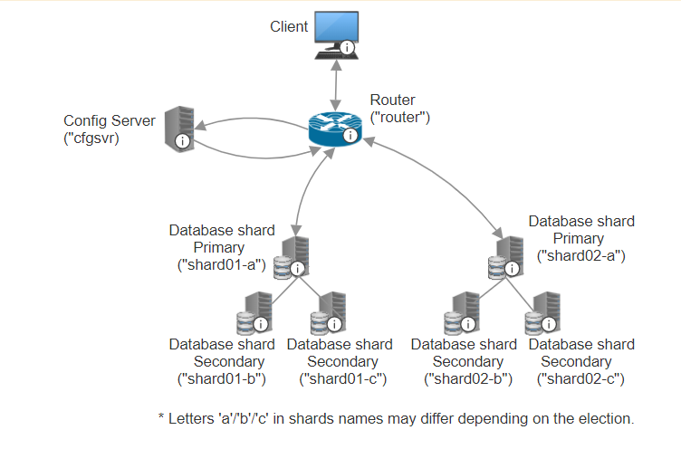
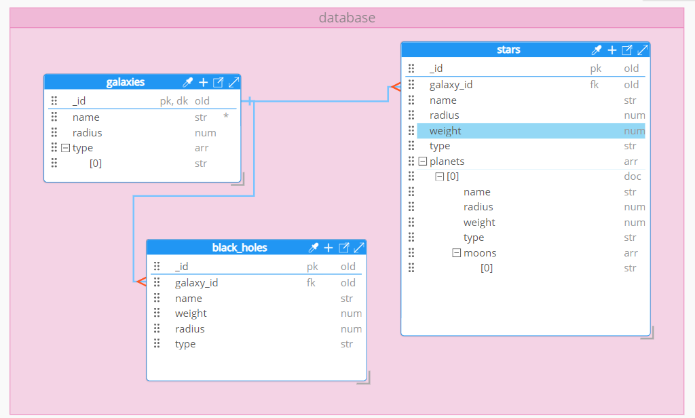

# MongoDB

## Structure of the database

### Database scheme

### Configuration
Docker compose creates 8 services:
* router (mongos instance) - main router which is responsible for all communication with a client. Router allows user to work with database using guest account.
* cfgsvr (mongod instance) - configuration server, which is responsible for storing information about sharding and data distibution, which it shares with router on a request.
* shard01-a/b/c (mongod instance) - create structure of the first shard. Store the same data in all 3 instances, which provides high redundancy and availability.
* shard02-a/b/c (mongod instance) - create structure of the second shard. Store the same data in all 3 instances, which provides high redundancy and availability.

- /scripts - used for storing initiation and insert scripts.
- /config - used for storing configuration files for mongod and mongos instances. Also stores keyfile, that is used to secure communication within cluster.
- /data - used for storing information while docker is down.

#### Cluster
The database uses 1 main cluster. 
That amount of clusters is enough for understanding the conception of clustering. 

#### Nodes
The database uses 8 nodes: 1 router, 1 config server and 3 + 3 shards. 
That number is enough to familiarize witch conception of clustering. 
It can be easly expanded further. 

#### Sharding
The database uses 2 shards. 
That amount is enough for understanding sharding on small dataset created for educational purposes. 
In the future, number of shards can be easily increased, based on expected amount of real data. 

#### Replication
Each shard consists of 3 instances, which store the same data. 
That is minimum amount of replicas recommended for replication by MongoDB. 

#### Persistence
Each change in dataset is immediately stored in primary (RAM/cache) and secondary memory (disk). 
This allows fast reply on frequent queries and good persistence. 
On the first lauch, data and validators are loaded from insert scripts. 
Then, all changes in database are stored in the '/data' folder, which allows to work with it even after rebooting the docker container. 

#### Data distibution
Each collection is distributed within 2 shards. 
Criterion of selecting where to store a new input record is **hashed objectId** (hash + objectId is a good combination as objectId almost always increases monotonically, which allows the server to uniformly distribute data within 2 shards).  
Inside the shard the new record is then stored in primary node and copied by sedondary nodes. 

#### Security
Internal Authentification is used within the cluster. 
That allows shards to communicate in a secure way using pregenerated key. 

Executing any command in any instance requires authorization.  
Basic root-user that is added to all instances is user with "admin" username and "1234" password.  
In addition, router allows to working in guest account with "guest" username and "guest" password.  
Guest is allowed to execute any read-write queries in database 'database'.  

## Using case
My database simulates a storage for information about different space objects (galaxies, stars, black holes, planets and moons).  
I decided to implement it using MongoDB as it allows to store huge amount of documets with high horizontal scalability.  

## Pros and cons
`+` Flexibility in scheme creation  
`+` Horizontal scalability  
`+` Different useful data types ('object', 'array', 'date' etc.)  
`+` Security features  

`-` It may be difficult to create some complex queries  
`-` Problems with integrity control  

## CAP theorem
The database architecture guarantees:  
* Availability - even if some primary node goes down, secondary nodes will select a new primary, whcih guarantees, that every query will get some reply.  
* Partition tolerance - while shard have secondary nodes to elect from, it can always select new primary node and continue working.  

The database architecture does not guarantee:  
* Consistency - there may appear situations, when primary node fails after some write operation before information was copied by secondary nodes. This may lead to a situation, when after the new primary node election a query returns obsolete data.  

## Dataset
Data were generated using chatgpt.com.  

* pk - primary key.
* dk - parent key.
* fk - foreign key.
* oId - objectId.

* 'radius' and 'weight' must be integer/float numbers > 0.
* 'type' in 'galaxy' collection must be an array that contains 1 or more of next values: "Spiral", "Elliptical", "Lenticular", "Irregular", "Active", "Seyfert", "Quasar", "Blazar".
* 'type' in 'black_holes' collection must be one of the next values: "Primordial", "Intermediate", "Supermassive", "Stellar".
* 'type' in 'stars' collection must be one of the next values:  "Main Sequence Star", "Red Giant", "White Dwarf", "Neutron Star", "Red Dwarf", "Brown Dwarf" .
* 'planets.type' in 'stars' collection must be one of the next values: "Gas Giant", "Terrestrial", "Neptune-Like", "Super-Earth".

## Conclusion
I have created NoSQL (MongoDB) database and familliarized with conceptions of clustering, sharding and replicas.  

## Sources
* https://github.com/minhhungit/mongodb-cluster-docker-compose/tree/master
* https://harsh05.medium.com/setting-up-mongodb-cluster-replication-sharding-and-high-availability-1c95290156ad
* https://www.filecloud.com/supportdocs/fcdoc/latest/server/filecloud-administrator-guide/filecloud-site-setup/filecloud-high-availability/enable-mongodb-cluster-authentication
* https://stackoverflow.com/questions/20117104/mongodb-root-user
* https://www.mongodb.com/docs/
* https://www.geeksforgeeks.org/datatypes-in-mongodb/
* https://www.scaler.com/topics/cap-theorem-mongodb/
* https://chatgpt.com